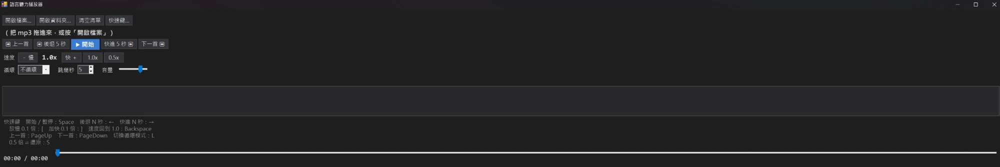

# 語言聽力播放器（LangPlayer）

聽語言教學 mp3 用的 Windows 11 小程式。單一 `.exe`，用 Windows 內建的 .NET Framework 4.8，**解壓就能跑，不用安裝**。



## 功能

- **開始／暫停**、上一首／下一首（播超過 3 秒按上一首＝回到這首開頭）
- **播放清單**：開檔案（可多選）、開資料夾（含子資料夾，依檔名排序）、或直接把檔案／資料夾**拖進視窗**；雙擊清單換首
- **循環**：不循環（清單播完停）／單曲循環／清單循環
- **速度 0.5～2.0 倍**，每次 0.1，**變速不變調**（Windows 內建媒體引擎的時間伸縮）；「0.5x」鈕一鍵切到 0.5 倍，再按一次還原成原本的速度
- **後退／快進 N 秒**，N 在畫面上設（1～120 秒）
- **音量**：只調這個程式，不動系統音量
- **快速鍵全部可自訂**（「快速鍵…」按鈕），可勾**全域**：切到其他視窗（例如邊聽邊打筆記）時照樣有效
- **夜晚模式**介面（深色背景、標題列、捲軸），播放進度拉桿在視窗最下方
- 支援 mp3、m4a、wav、wma、aac、flac
- **關掉再開維持上次的樣子**：視窗大小、位置、是否最大化（上次的位置已經不在任何螢幕上時改回置中），播放清單（找不到的檔略過），並選回上次播的那首、停在開頭，按開始才播
- 設定（快速鍵、速度、循環、跳幾秒、音量、上次的資料夾、視窗、上次那首）存在 exe 旁的 `settings.ini`，播放清單存在 `playlist.txt`（一行一個路徑）

## 預設快速鍵

| 動作 | 按鍵 |
|---|---|
| 開始／暫停 | Space |
| 後退／快進 N 秒 | ← ／ → |
| 放慢／加快 0.1 倍 | [ ／ ] |
| 速度回到 1.0 | Backspace |
| 上一首／下一首 | PageUp ／ PageDown |
| 切換循環模式 | L |
| 0.5 倍 ⇄ 還原 | S |

**全域快速鍵只套用有 Ctrl／Alt／Shift 的組合**（例如 Ctrl+Alt+Space）。單一按鍵如果也搶成全域，別的程式就打不了字，所以單鍵只在本視窗有效。要用全域，先到「快速鍵…」把想要的動作改成組合鍵，再勾「全域快速鍵」。被別的程式占用的組合會跳提示。

## 建置

不用裝任何 SDK，用 Windows 內建的 C# 編譯器：

```
build.bat
```

產出 `dist\LangPlayer.exe`。原始碼在 `src\`：

| 檔案 | 內容 |
|---|---|
| `MainForm.cs` | 主視窗、播放控制（WPF `MediaPlayer`）、清單、視窗內與全域快速鍵 |
| `HotkeyDialog.cs` | 快速鍵設定視窗 |
| `Settings.cs` | 動作清單、預設快速鍵、`settings.ini` 與 `playlist.txt` 讀寫 |
| `Theme.cs` | 夜晚模式配色（WinForms 沒有內建深色主題，逐一上色） |
| `app.manifest` | 高 DPI 與新版控制項外觀 |

⚠️ 編譯器是 .NET Framework 內建的 `csc.exe`，只支援 **C# 5**：不能用字串插值 `$"..."`、`?.`、`=>` 屬性、`nameof`。`build.bat` 內的註解要維持純 ASCII（cmd 會用 Big5 讀檔）。
